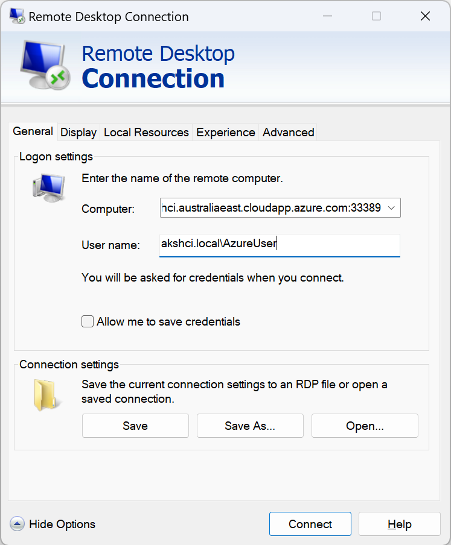

# AKS Hybrid boot camp

This boot camp will explain what Azure Kubernetes Service (AKS) hybrid is focusing on the design and architecture of AKS hybrid solutions, as part of this boot camp the following topics will be covered:

1. [Creation of aks host](./00-aks-host/script.ps1)
2. [Creation of aks workload cluster](./01-new-workload-cluster/script.ps1)
3. [Connecting to workload cluster](./02-kubectl-to-cluster/script.ps1)
4. [Deploy aks app](./03-deploy-app/script.ps1)
5. [Configure azure ad authentication](./04-azure-ad/script.ps1)
6. [Configure azure RBAC](./05-azure-rbac/script.ps1)
7. [Configure monitoring](./06-monitoring/script.ps1)
8. [Provision ARC resource bridge](./07-resource-bridge/script.ps1)
9. [Patching and upgrade](./08-patching-and-upgrade/script.ps1)
10. [Autoscaler](./09-autoscaler/script.ps1)

## Duration

This boot camp will have a duration of **5 hours**, during this time it will not be possible to cover all the scenarios described, it is expected that attendants will try some of them at their own pace.

## Audience

This boot camp is targeted to the following roles:

- Azure Stack HCI infrastructure engineer looking to understand better what Kubernetes is and what administrative/operational tasks are needed in the Stack HCI environment
- Kubernetes / AKS Admin looking at understanding AKS hybrid solution and differences between AKS hybrid and other K8s distribution (cloud based or on-premises)

## Environment setup

We will use a Windows Server nested virtualization environment installed [following the official instructions](https://learn.microsoft.com/azure/aks/hybrid/aks-hci-evaluation-guide-1). The process is recorded in the following video:

[](https://youtu.be/cMSzEHZsxJY)

Use the following button to deploy in your Azure Subscription:

[](https://portal.azure.com/#create/Microsoft.Template/uri/https%3A%2F%2Fraw.githubusercontent.com%2FAzure%2Faks-hci%2Fmain%2Feval%2Fjson%2Fakshcihost.json)

Things to note:

- Select a `Region` that supports all public preview features, like Australia East, East US, Southeast Asia, or West Europe Azure region, as documented in [the learn page](https://learn.microsoft.com/azure/aks/hybrid/system-requirements?tabs=allow-table#azure-resource-group).
- Change `Data Disk Type` to `Premium_LRS`.
- Change `Data Disk Size` to 256.
- Change the `Custom Rdp Port` to 33389 or something else to avoid exposing RDP from the well known port.

Your deployment should look like the following:


Once the virtual machine is up and running, you can connect to it through remote desktop using the local `akshci.local\AzureUser` account:



You should install/configure the following tools:

- Open a powershell and update the PowershellGet module with the following command:

  ```powershell
  Install-PackageProvider -Name NuGet -Force
  Install-Module -Name PowershellGet -Force -Confirm:$false -SkipPublisherCheck
  ```

  Reopen the PowerShell terminal to apply changes.

- Install AksHCI PowerShell module

  ```powershell
  Install-Module -Name AksHci -Repository PSGallery -Force -AcceptLicense
  ```

- Install [VSCode](https://community.chocolatey.org/packages/vscode.install), [Git](https://community.chocolatey.org/packages/git), [Az Powershell](https://community.chocolatey.org/packages/az.powershell).
  
  ```powershell
  choco install vscode.install git az.powershell
  ```

- Install [az cli](https://learn.microsoft.com/cli/azure/install-azure-cli-windows?tabs=powershell).

  ```powershell
  $ProgressPreference = 'SilentlyContinue'; Invoke-WebRequest -Uri https://aka.ms/installazurecliwindows -OutFile .\AzureCLI.msi; Start-Process msiexec.exe -Wait -ArgumentList '/I AzureCLI.msi /quiet'; Remove-Item .\AzureCLI.msi
  ```

- Restart the powershell terminal for applications to be added in the PATH.
- Clone the boot camp repo in Desktop and open it in VSCode

  ```powershell
  cd ~/Desktop
  git clone https://github.com/oardevol/ftahybrid-aksbootcamp
  cd ftahybrid-aksbootcamp
  code .
  ```

  Trust the author to be able to execute scripts.
- Install the following VSCode extensions:
  - [PowerShell](https://marketplace.visualstudio.com/items?itemName=ms-vscode.PowerShell) but do not install PowerShell 7.0

From this point on you are ready to start executing the commands in the various `script.ps1` files of this boot camp, selecting them and then hitting `F8`. Before executing the scripts, you should execute `env.ps1` to define all environment variables used within the scripts. Make sure these variables point to your deployment.

> Note: You should turn off the VM after setup and start it during the boot camp.

## Reset environment

If for any reason you need to restart the process:

``` Powershell
Uninstall-akshci
```
